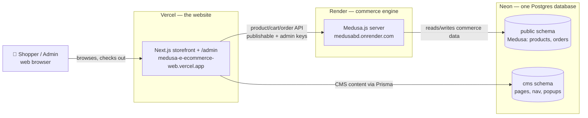

# Go-Live Guide — Deploy this store for **free** (Neon + Render + Vercel)

A complete, beginner-friendly, first-to-last walkthrough of how this project was
taken live. No prior DevOps knowledge assumed. Everything here is **free tier**.

> This guide documents the **real** deployment we did — including the errors we
> hit and exactly how we fixed them (see [Gotchas](#gotchas-real-errors-we-hit--fixes)).
> If you redeploy from scratch, follow it top to bottom.

---

## 1. The big picture

Your app has **three separate pieces**, each hosted on a service that's good at it:



If GitHub's diagram doesn't render, here's the same thing in plain text:

```
  Browser
     │
     ▼
  Vercel  ──────────────►  Render (Medusa)  ──────►  Neon DB ▸ public schema
 (Next.js website          commerce engine          (products, orders)
  + /admin panel)
     │
     └───────────────────────────────────────────►  Neon DB ▸ cms schema
                              (Prisma)               (pages, nav, popups)
```

**Why three hosts?** Medusa is an always-on Node server (can't run on Vercel's
serverless functions), the website is best on Vercel, and Neon gives a free
Postgres that holds **both** Medusa's tables (`public` schema) and the CMS tables
(`cms` schema) in **one** database.

| Piece | Host | Free? | Notes |
|---|---|---|---|
| PostgreSQL database | **Neon** | ✅ | One DB, two schemas (`public` + `cms`). US region (close to Render/Vercel). |
| Medusa backend | **Render** (Web Service) | ✅ | Node 20, Docker. Free instance **sleeps when idle** (~30–60s cold start). |
| Storefront + Admin | **Vercel** | ✅ | Next.js. Builds in ~2–4 min. |
| Redis | — | ✅ | Not needed; Medusa uses in-memory modules. |

---

## 2. Before you start

- A **GitHub account** with this repo pushed (Render + Vercel deploy from GitHub).
- Free accounts on **neon.tech**, **render.com**, **vercel.com** (sign in with GitHub).
- **Node 20** locally for the one-time database seeding (`apps/medusa` needs Node 20).
- **bun** for the web/CMS workspace.
- Generate your secrets once and keep them in a **gitignored** file
  (`.env.deploy-secrets`). Generate random ones with:
  ```bash
  openssl rand -hex 32     # for JWT_SECRET, COOKIE_SECRET, ADMIN_SESSION_SECRET
  ```

---

## 3. Step 1 — Database (Neon)

1. Create a project at **neon.tech** (name it `ecom`). Copy the **connection
   string** — you'll get a **pooled** one (host contains `-pooler`). The
   non-pooled (**direct**) host is the same without `-pooler`.
   - **Direct** (use for migrations/seeding & the always-on Medusa server):
     `postgresql://USER:PW@ep-xxx.REGION.aws.neon.tech/neondb?sslmode=require`
   - **Pooled** (use for serverless Vercel):
     `postgresql://USER:PW@ep-xxx-pooler.REGION.aws.neon.tech/neondb?sslmode=require`
2. Create the CMS schema and push + seed the CMS content (run locally):
   ```bash
   # create the cms schema
   psql "postgresql://USER:PW@ep-xxx.REGION.aws.neon.tech/neondb?sslmode=require" \
     -c "CREATE SCHEMA IF NOT EXISTS cms;"

   # push CMS tables + seed starter content (home page, nav, popup)
   export CMS_DATABASE_URL="postgresql://USER:PW@ep-xxx.REGION.aws.neon.tech/neondb?sslmode=require&schema=cms"
   bun run --filter @ecom/cms db:generate
   bun run --filter @ecom/cms db:push
   bun run --filter @ecom/cms db:seed
   ```

---

## 4. Step 2 — Seed the commerce data (run locally against Neon)

> Render's **free** tier has **no shell**, so we seed Medusa's data from our own
> machine, pointing at Neon. Then Render just *runs* the server.

```bash
export PATH="/opt/homebrew/opt/node@20/bin:$PATH"          # Node 20
cd apps/medusa/apps/backend
npm install
export DATABASE_URL="postgresql://USER:PW@ep-xxx.REGION.aws.neon.tech/neondb?sslmode=require"  # DIRECT

npx medusa db:migrate                                       # ~150 tables (slow if far from US region)
npx medusa exec ./src/scripts/create-storefront-api-key.ts # prints sk_... (admin API key)
npx medusa exec ./src/scripts/seed-rich-catalog.ts         # BDT region + demo products + stock
npx medusa exec ./src/scripts/seed-promotions.ts           # WELCOME10 promo
npx medusa user -e admin@yourbrand.com -p 'STRONG_PASSWORD' # Medusa admin login

# get the publishable key (pk_...) for the storefront:
psql "$DATABASE_URL" -tAc "SELECT token FROM api_key WHERE type='publishable' LIMIT 1;"
```

Save the printed **`pk_...`** (publishable) and **`sk_...`** (admin) keys — the
website needs both.

> 💡 The migration is latency-bound: every statement round-trips to the US-region
> DB. From far away it can take several minutes. This is a **one-time** local cost;
> the live site (Render/Vercel are in the US, next to Neon) is not affected.

---

## 5. Step 3 — Medusa backend (Render)

This repo ships a **Dockerfile** at `apps/medusa/apps/backend/Dockerfile`, so
Render builds via Docker (it **ignores** the Build/Start command fields — that's
normal; you won't see them).

1. Render → **New + → Web Service** → connect the GitHub repo.
2. Settings:
   - **Root Directory**: `apps/medusa/apps/backend`
   - **Region**: a **US** region (closest to Neon)
   - **Instance Type**: **Free**
   - Build/Start commands: **not shown** (Dockerfile handles it).
3. **Environment variables** (add these, then it builds):
   ```
   NODE_VERSION  = 20
   DATABASE_URL  = <Neon DIRECT connection string>
   JWT_SECRET    = <random 64-hex>
   COOKIE_SECRET = <random 64-hex>
   ```
4. Click **Create Web Service**. Copy the URL it assigns (e.g.
   `https://medusabd.onrender.com`), then add the CORS vars:
   ```
   ADMIN_CORS = https://medusabd.onrender.com
   STORE_CORS = https://medusabd.onrender.com      # add your Vercel URL in Step 5
   AUTH_CORS  = https://medusabd.onrender.com       # add your Vercel URL in Step 5
   ```
5. Wait for **"Server is ready"**. Verify:
   - `https://medusabd.onrender.com/health` → `OK`
   - `https://medusabd.onrender.com/app` → Medusa admin login

> ⏳ **Why deploys are slow (5–10 min):** the Docker build runs `npm install`,
> then `medusa build` (compiles backend **+** builds the admin dashboard), then a
> **second** `npm install` for the built server — on a small free machine. Render
> caches layers, so later deploys (code-only changes) are faster. The startup
> command auto-runs DB migrations (`--skip-scripts`) then starts the server.

---

## 6. Step 4 — Storefront + Admin (Vercel)

1. Vercel → **Add New → Project** → import the repo.
2. Settings (it's a **bun monorepo**):
   - **Framework**: Next.js (auto)
   - **Root Directory**: `apps/web` → ✅ **Include files outside the Root Directory**
   - Install/Build commands: leave default (Vercel uses `bun install` + `next build`).
3. **Environment variables** (Production):
   ```
   CMS_DATABASE_URL                   = <Neon POOLED string>?sslmode=require   (keep it simple — see Gotcha #4)
   NEXT_PUBLIC_MEDUSA_BACKEND_URL     = https://medusabd.onrender.com
   NEXT_PUBLIC_MEDUSA_PUBLISHABLE_KEY = pk_...
   MEDUSA_ADMIN_API_KEY               = sk_...
   ADMIN_PASSWORD                     = <password for /admin>
   ADMIN_SESSION_SECRET               = <random 64-hex>
   NEXT_PUBLIC_SITE_URL               = https://<your-app>.vercel.app   (add after first deploy)

   # Optional — real email (Brevo free tier; see docs/smoke-tests/50-email-brevo.md)
   BREVO_API_KEY                      = xkeysib-…
   EMAIL_FROM                         = <Brevo-verified sender address>
   EMAIL_FROM_NAME                    = Maison
   OTP_DEMO_CODES                     = true   (ONLY until Brevo is set up; then remove)

   # Optional — real SMS OTP (MiMSMS, prepaid). MiMSMS only whitelists STATIC
   # IPs, so all SMS goes through the relay on Render (fixed outbound IPs):
   SMS_PROVIDER                       = mimsms
   MIMSMS_RELAY_URL                   = https://medusabd.onrender.com/sms
   SMS_RELAY_SECRET                   = <random hex — same value on Render>
   # On the RENDER service, add instead: MIMSMS_API_KEY, MIMSMS_USERNAME,
   # MIMSMS_SENDER_ID, SMS_RELAY_SECRET. In the MiMSMS panel, whitelist the
   # Render service's static outbound IPs (dashboard → Connect → Outbound)
   # and the domain medusabd.onrender.com.

   # Optional — online payment (SSLCommerz free sandbox; see docs/smoke-tests/51-payment-sslcommerz.md)
   SSLCOMMERZ_STORE_ID                = <sandbox store id>
   SSLCOMMERZ_STORE_PASSWORD          = <sandbox store password>
   # SSLCOMMERZ_LIVE=true only for a real production SSLCommerz store

   # Optional — Steadfast Courier handover (steadfastcourier.com merchant account)
   STEADFAST_API_KEY                  = <portal.packzy.com → API → Api Key>
   STEADFAST_SECRET_KEY               = <portal.packzy.com → API → Secret Key>
   # STEADFAST_BASE_URL               = https://portal.packzy.com/api/v1   (default — set only to override)
   # Without the two keys the "Send to Steadfast" button simply doesn't appear
   # on /admin/orders/[id]; manual tracking-number handover keeps working.
   ```
4. **Deploy.** Copy your Vercel URL when it's green.

---

## 7. Step 5 — Connect the two (final wiring)

1. **Vercel**: add `NEXT_PUBLIC_SITE_URL = https://<your-app>.vercel.app`, then
   **Redeploy** (Deployments → ⋯ → Redeploy — env-var changes need a redeploy).
2. **Render**: update CORS to allow the website, then it redeploys:
   ```
   STORE_CORS = https://<your-app>.vercel.app
   AUTH_CORS  = https://<your-app>.vercel.app,https://medusabd.onrender.com
   ```

**Smoke test the live site:** browse `/products` → open a product → **Add to Bag**
→ cart → **Checkout** (Cash on Delivery) → `/track` the order → log into `/admin`.

---

## 8. Gotchas (real errors we hit + fixes)

These are baked into the repo now, but here's what they were so you understand them:

1. **Render build fails: TypeScript errors in seed scripts.**
   `medusa build` type-checks **all** `.ts` files; the one-off seed scripts had
   strict-null violations against Medusa's nullable query types.
   *Fix:* made the seed scripts type-safe (commit `3655c64`).

2. **Render starts but crashes: `Countries … already assigned to a region`.**
   The Dockerfile's `medusa db:migrate` also runs the data-seed migration script,
   which isn't idempotent — and we'd already seeded.
   *Fix:* `medusa db:migrate --skip-scripts` in the Dockerfile `CMD` (commit `fb88821`).

3. **Vercel build fails: `Parameter 'c' implicitly has an 'any' type`.**
   The Prisma client wasn't generated on Vercel's fresh install, so CMS types
   collapsed to `any`.
   *Fix:* the web `build` script now runs `prisma generate` first (commit `d77f8c7`):
   `"build": "bun run --filter @ecom/cms db:generate && next build"`.

4. **Vercel runtime 500: `Query Engine for runtime "rhel-openssl-3.0.x" not found`.**
   Prisma only built the engine for the build machine, not Vercel's serverless
   runtime, and Next didn't bundle it.
   *Fix (commit `b61f554`):*
   - `binaryTargets = ["native", "rhel-openssl-3.0.x"]` in `schema.prisma`
   - `next.config.ts`: `serverExternalPackages: ["@prisma/client"]` +
     `outputFileTracingIncludes` to copy `libquery_engine-rhel-openssl-3.0.x.so.node`
     into each server route.

5. **Vercel runtime 500: `invalid domain character in database URL`.**
   The `CMS_DATABASE_URL` pasted into Vercel got a hidden newline/space (long
   string with `&` params).
   *Fix:* re-paste a **minimal** value with no extra params — the Prisma models
   already declare their schema, so you only need
   `...neon.tech/neondb?sslmode=require`. Double-check there's no trailing
   whitespace/line break in the Vercel field.

---

## 9. Environment variables cheat-sheet

| Variable | Where | Value |
|---|---|---|
| `DATABASE_URL` | Render | Neon **direct** string (`public` schema, Medusa) |
| `JWT_SECRET`, `COOKIE_SECRET` | Render | random 64-hex each |
| `STORE_CORS` / `ADMIN_CORS` / `AUTH_CORS` | Render | allowed origins (Vercel + Render URLs) |
| `NODE_VERSION` | Render | `20` |
| `CMS_DATABASE_URL` | Vercel | Neon **pooled** string, minimal (`?sslmode=require`) |
| `NEXT_PUBLIC_MEDUSA_BACKEND_URL` | Vercel | `https://<render>.onrender.com` |
| `NEXT_PUBLIC_MEDUSA_PUBLISHABLE_KEY` | Vercel | `pk_...` |
| `MEDUSA_ADMIN_API_KEY` | Vercel | `sk_...` (server-only) |
| `ADMIN_PASSWORD`, `ADMIN_SESSION_SECRET` | Vercel | `/admin` gate |
| `NEXT_PUBLIC_SITE_URL` | Vercel | your Vercel URL |

> Never commit secrets. `.env*` is gitignored. Generate fresh secrets for
> production — don't reuse dev ones.

---

## 10. Deploying updates later

- **Website / CMS / UI change** → push to `master`; **Vercel auto-deploys**.
- **Medusa backend change** → push to `master`; **Render auto-deploys** (Docker
  rebuild; migrations auto-run on start with `--skip-scripts`).
- **New CMS schema change** → run `bun run --filter @ecom/cms db:push` against Neon.
- **New Medusa migration** → it runs automatically on the next Render deploy.

---

## 11. Free-tier limits & upgrade path

- **Render sleeps when idle** → first request after a nap is slow (~30–60s). Paid
  Render ($7/mo) keeps it awake (or use Railway/Fly).
- **Payments**: Cash on Delivery works today; add **Stripe/bKash/Nagad** for online
  payments when you launch.
- **Auth**: `/admin` is a single shared password — add per-user RBAC before a
  serious public launch.
- **Custom domain**: add it in Vercel, set `NEXT_PUBLIC_SITE_URL`, and add the
  domain to Render's `STORE_CORS`/`AUTH_CORS`. Point Medusa at a subdomain
  (e.g. `api.yourdomain.com`).

---

## 12. Live URLs (this deployment)

- **Storefront**: https://medusa-e-ecommerce-web.vercel.app
- **Medusa admin**: https://medusabd.onrender.com/app
- **Storefront admin (CMS)**: https://medusa-e-ecommerce-web.vercel.app/admin
